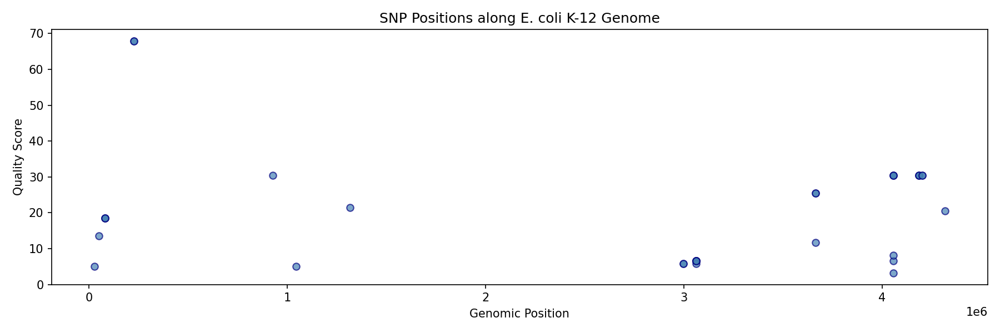
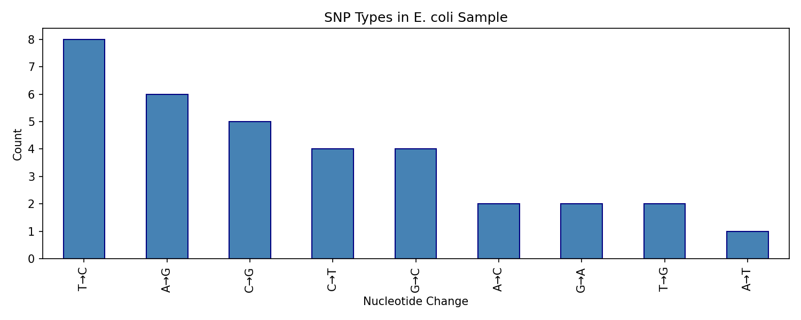

# NGS Variant Calling Pipeline

A reproducible Next Generation Sequencing (NGS) analysis pipeline implemented 
using Bash and Python, demonstrating a complete variant calling workflow on 
real *E. coli* K-12 sequencing data.

## Pipeline Overview
```
FASTQ reads (SRR1553607)
        ↓
Quality Control (FastQC)
        ↓
Read Alignment to Reference Genome (BWA)
        ↓
BAM Processing & Sorting (SAMtools)
        ↓
Variant Calling (BCFtools)
        ↓
Quality Filtering (QUAL > 20)
        ↓
Variant Parsing & Visualisation (Python)
```

## Tools Used

| Tool | Version | Purpose |
|------|---------|---------|
| FastQC | 0.12+ | Sequencing quality control |
| BWA | 0.7+ | Read alignment |
| SAMtools | 1.x | BAM processing |
| BCFtools | 1.x | Variant calling & filtering |
| Python | 3.x | Variant parsing & visualisation |
| pandas | 2.x | Data analysis |
| matplotlib | 3.x | Visualisation |

## Dataset

- **Sample:** E. coli K-12 (SRR1553607) from NCBI SRA
- **Reference genome:** E. coli K-12 MG1655 (GCF_000005845.2)
- **Reads used:** 50,000 paired-end reads

## Project Structure
```
ngs-variant-calling-pipeline/
│
├── data/                         # Raw FASTQ files (not tracked by git)
├── reference/                    # Reference genome (not tracked by git)
├── results/                      # Pipeline outputs (not tracked by git)
│   ├── aligned_sorted.bam        # Sorted alignment
│   ├── variants.vcf              # Raw variant calls
│   ├── variants_filtered.vcf     # High-quality variants (QUAL>20)
│   ├── variant_summary.csv       # Parsed variant table
│   ├── snp_plot.png              # SNP positions along genome
│   └── snp_types.png            # SNP type distribution
│
├── scripts/
│   ├── pipeline.sh               # Main Bash pipeline
│   └── parse_variants.py         # Python variant parser
│
├── requirements.txt              # Python dependencies
└── README.md
```

## Results

- **Total variants called:** 34 SNPs
- **High-quality variants (QUAL>20):** ~20 SNPs
- **Mean quality score:** 19.63
- **Most common SNP types:** T→C (8) and A→G (6)

### Biological Interpretation

The dominance of T→C and A→G transitions is consistent with known 
*E. coli* mutational patterns. These complementary mutations represent 
the same event on opposite DNA strands, likely caused by oxidative DNA 
damage and replication errors by DNA polymerase — a well-characterised 
mutational signature in bacterial genomes.

### SNP Distribution


### SNP Types


## How to Run

### 1. Install system dependencies
```bash
sudo apt install fastqc bwa samtools bcftools sra-toolkit
```

### 2. Set up Python environment
```bash
python3 -m venv venv
source venv/bin/activate
pip install -r requirements.txt
```

### 3. Download data
```bash
cd data && fastq-dump --split-files -X 50000 SRR1553607 && cd ..
cd reference
wget "https://ftp.ncbi.nlm.nih.gov/genomes/all/GCF/000/005/845/GCF_000005845.2_ASM584v2/GCF_000005845.2_ASM584v2_genomic.fna.gz"
gunzip *.gz && mv *.fna ecoli_k12.fasta && cd ..
```

### 4. Run the pipeline
```bash
bash scripts/pipeline.sh
```

### 5. Parse and visualise variants
```bash
python scripts/parse_variants.py
```

## Skills Demonstrated

- Linux command line & Bash scripting
- NGS data processing (FASTQ → BAM → VCF)
- Sequencing quality control
- Read alignment to reference genomes
- Variant calling and quality filtering
- Python data analysis and visualisation
- Reproducible research practices
- Version control with Git

